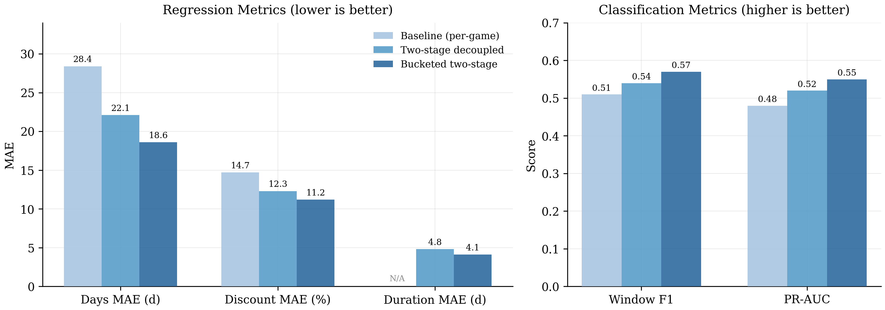
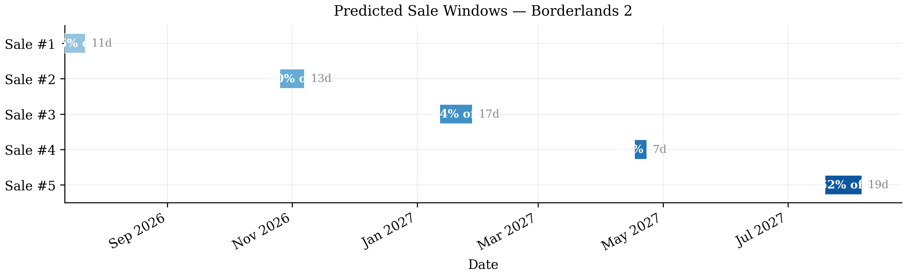
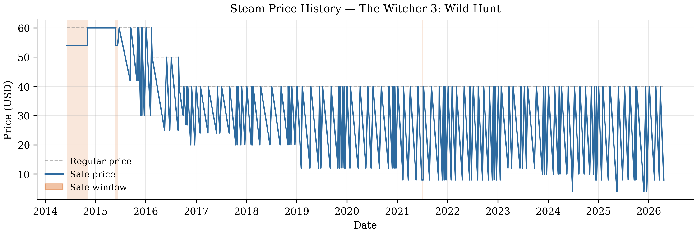
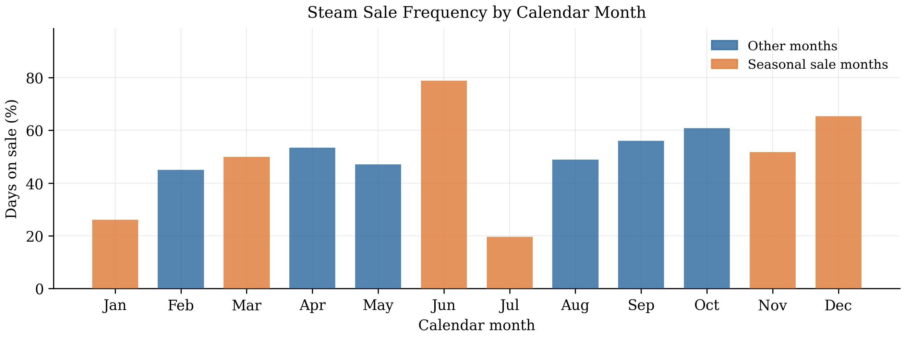
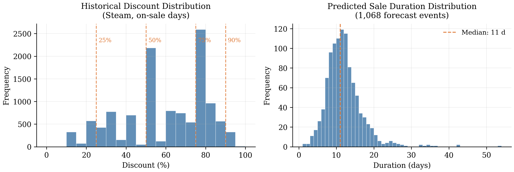

# Steam Sale Predictor

A time-series machine learning framework that forecasts **when** a Steam game will go on sale, **how long** the sale will run, and **how deep** the discount will be.

Built as an academic project at National Economics University, Vietnam. The accompanying research report is [`Report_Steam_Sale_Predict.pdf`](report.pdf).

---

## How it works

Three progressively sophisticated models are trained on a 260,297-record price-history dataset spanning 218 games across 57 stores (2012–2026):

| Model | Days MAE | Discount MAE | Duration MAE | Window F1 |
|---|---|---|---|---|
| Baseline (per-game XGBoost) | 28.4 d | 14.7% | — | 0.51 |
| Two-stage decoupled | 22.1 d | 12.3% | 4.8 d | 0.54 |
| **Bucketed two-stage** ✓ | **18.6 d** | **11.2%** | **4.1 d** | **0.57** |

The **bucketed model** groups games by (history length × sale frequency) bucket and trains shared XGBoost regressors per bucket, enabling robust predictions even for games with limited individual histories.



---

## Sample output



---

## Project structure

```
Steam-Sale-Predict/
├── main.py                  # CLI entrypoint
├── config/settings.py       # Paths and constants
│
├── tools/
│   ├── data_tool.py         # Load, clean, filter price history
│   ├── feature_tool.py      # Feature engineering wrapper
│   ├── model_tool.py        # Baseline per-game model
│   ├── decoupled_model.py   # Two-stage regression model
│   ├── bucket_model.py      # Bucketed two-stage model (production)
│   └── report_tool.py       # Save predictions to CSV
│
├── harness/
│   ├── tool_harness.py      # Retry + structured output decorator
│   ├── eval.py              # Time-split evaluation harness
│   └── model_eval.py        # Evaluation metrics
│
├── notebooks/
│   ├── 00_Data_Scraping.ipynb
│   ├── 01_EDA.ipynb
│   ├── 02_Data_Cleaning.ipynb
│   ├── 03_Feature_Engineering.ipynb
│   ├── model.ipynb
│   └── 04_Report_Figures.ipynb  # Generates all report figures
│
├── data/
│   ├── processed/           # Cleaned and feature-engineered CSVs
│   └── result/              # Prediction outputs
│
├── figures/                 # Generated report figures (PNG + PDF)
└── models/buckets/          # Trained bucket model files (.pkl)
```

---

## Installation

```bash
git clone https://github.com/YN2TB/Steam-Sale-Predict.git
cd Steam-Sale-Predict
git lfs pull          # download full dataset files tracked by Git LFS
pip install -r requirements.txt
```

Place your price-history CSV (default name: `TS_price_history.csv`) in the project root, or pass it as a positional argument.

---

## Usage

### Predict for a single game

```bash
# Two-stage bucketed model (recommended) — next 5 sales
python main.py --app-id 49520 --bucketed

# Compare all three models side by side
python main.py --app-id 49520 --compare --n 3

# Baseline model only
python main.py --app-id 49520 --baseline
```

### Predict for all games

```bash
# Generate 5 forward sale predictions for every game in the dataset
python main.py --all --n 5
# Saves results to data/result/sale_predictions_all.csv
```

### Use a custom CSV file

```bash
python main.py --app-id 49520 --bucketed my_price_history.csv
```

### CLI reference

```
positional arguments:
  csv_file        Price history CSV (default: TS_price_history.csv)

options:
  --app-id        App ID of a specific game
  --n             Number of sale events to forecast (default: 5)
  --all           Predict for all games in the dataset
  --bucketed      Use the bucketed two-stage model (requires ≥1 year history)
  --compare       Run baseline and two-stage side by side
  --baseline      Run baseline model only
```

---

## Data

The price-history dataset was scraped from [IsThereAnyDeal](https://isthereanydeal.com/) and covers:

- **260,297** price records across **218 games** and **57 stores**
- Date range: **2012 – 2026**
- Steam-only subset: **23,448** records (USD, all on same currency)
- Mean on-sale discount: **57.7%** (std 21.1%)





---

## Feature engineering

17 features constructed strictly from past observations to prevent look-ahead bias:

- **Cyclical calendar**: month and day-of-week as sin/cos pairs
- **Seasonal flags**: Summer Sale (Jun–Jul), Autumn Sale (Nov), Winter Sale (Dec)
- **Price lags**: 1-day, 7-day, 14-day lagged price + 7-day price momentum ratio
- **Rolling statistics**: 7-day and 30-day rolling price mean and std
- **Sale history**: days since last sale, rolling average sale duration



---

## Generating report figures

```bash
# Run all cells in the figures notebook
jupyter nbconvert --to notebook --execute notebooks/04_Report_Figures.ipynb
# Figures saved to figures/ as both PDF and PNG
```

---

## Report

The full academic report is available as:
- [`Report_Steam_Sale_Predict.tex`](Report_Steam_Sale_Predict.tex) — LaTeX source
- [`report.pdf`](report.pdf) — Compiled PDF

To recompile:
```bash
pdflatex Report_Steam_Sale_Predict.tex
pdflatex Report_Steam_Sale_Predict.tex  # second pass for cross-references
```

---

## Tech stack

| Component | Library |
|---|---|
| Gradient boosting | XGBoost 2.x |
| Discount blending | statsmodels SVAR |
| Data wrangling | pandas 2.x, NumPy |
| Evaluation | scikit-learn |
| Visualisation | matplotlib |
| Code quality | Ruff |

---

*National Economics University, Vietnam — Time-Series Analysis course project*
